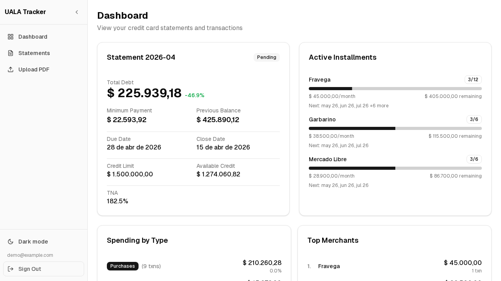
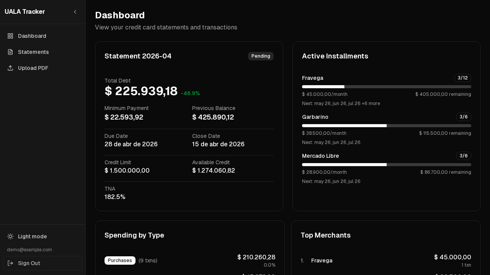

# UALA Tracker

Web app to upload Ualá credit card PDF statements, track transactions, and visualize spending — with per-user data isolation.

| Light mode | Dark mode |
|---|---|
|  |  |

## Features

- **PDF upload** — upload Ualá statements and extract data automatically via a Python API
- **Dashboard** — KPIs, spending by type, top merchants, and monthly evolution chart
- **Installments** — active installment tracking with remaining amounts and projected due dates
- **Statement management** — list all statements, mark as paid
- **API Keys & Automation** — generate API keys to automate statement ingestion via Make.com, n8n, or custom scripts
- **Multi-user** — each user sees only their own data (Supabase RLS)
- **Auth** — sign up, login, and session management via Supabase

## Tech stack

- [Next.js](https://nextjs.org) (App Router) + TypeScript
- [Supabase](https://supabase.com) — PostgreSQL + Auth + RLS
- [Vercel Python Functions](https://vercel.com/docs/functions/runtimes/python) — PDF extraction (`/api/extract`) and ingestion (`/api/ingest`) via `pypdf` + FastAPI

## Getting started

### 1. Clone and install

```bash
git clone https://github.com/0xMar/uala-tracker.git
cd uala-tracker
pnpm install
```

### 2. Set up Supabase

1. Create a project at [supabase.com](https://supabase.com).
2. Run the core schema: [`scripts/001_schema.sql`](scripts/001_schema.sql)
3. Run the API keys schema: [`scripts/002_api_keys.sql`](scripts/002_api_keys.sql)

### 3. Configure environment variables

```bash
cp .env.example .env.local
```

```env
NEXT_PUBLIC_SUPABASE_URL=https://<project>.supabase.co
NEXT_PUBLIC_SUPABASE_ANON_KEY=<anon-key>

# Shared secret between Next.js and the Python extraction API
EXTRACT_API_SECRET=<random-secret>

# Required for /api/ingest (automation)
# Dashboard → Settings → API Keys → service_role
SUPABASE_SECRET_KEY=<service-role-key>

# HMAC secret for API key hashing
API_KEY_HMAC_SECRET=<random-hex-32>
```

> Generate secrets with `openssl rand -base64 32` or `openssl rand -hex 32`.
> Set all variables in both `.env.local` and your Vercel project settings.

### 4. Install Python dependencies

The project uses [uv](https://docs.astral.sh/uv/) for Python dependency management.

```bash
uv sync --dev
```

To run the Python tests:

```bash
uv run pytest
```

### 5. Run locally

Use `vercel dev` to run both Next.js and Python Functions together:

```bash
npx vercel dev
```

Open [http://localhost:3000](http://localhost:3000).

> `pnpm dev` works for UI-only development, but PDF uploads will fail since `/api/extract` won't be available.

## Automation

You can automate statement ingestion (e.g. from Gmail via Make.com or n8n) using the `/api/ingest` endpoint:

1. Generate an API Key in **Settings → API Keys**.
2. Send a `POST` request to `/api/ingest` with the PDF as `multipart/form-data` and the key in the `X-API-Key` header.

See [`docs/MAKE_SETUP.md`](docs/MAKE_SETUP.md) for a step-by-step Make.com integration guide.

## PDF processing

Two Python Functions handle PDF data:

- `POST /api/extract` — parses a PDF and returns structured JSON (used by the UI upload flow)
- `POST /api/ingest` — validates an API key, parses the PDF, and persists data directly to Supabase (used by automation)

Files are processed in memory and never persisted.

## Demo

A read-only demo with mock data is available at [v0-uala-tracker-frontend.vercel.app/demo](https://v0-uala-tracker-frontend.vercel.app/demo).
